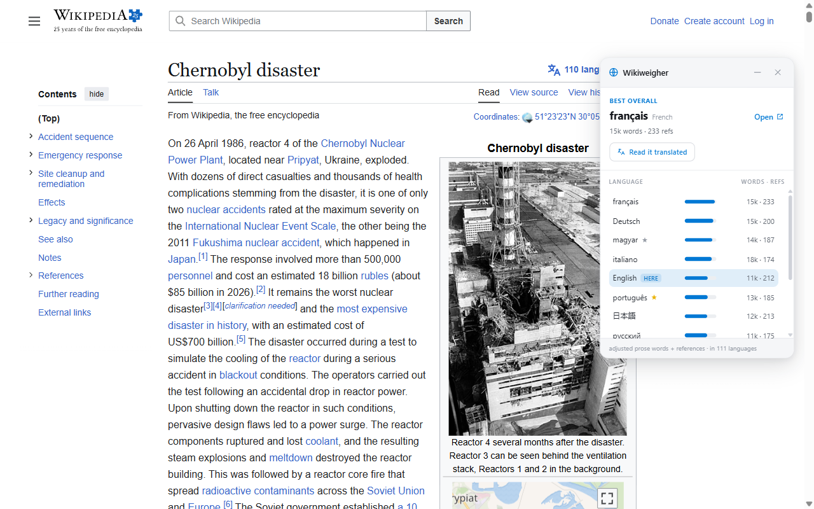

<div align="center">

<h1>
  <picture>
    <source media="(prefers-color-scheme: dark)" srcset="store/logo-dark.svg">
    
  </picture>
</h1>

**The same Wikipedia article is not the same in every language. This tells you which one to read.**
It measures the leading language versions of the article you are on and names the strongest.

[](https://github.com/intactdots/wikiweigher/actions/workflows/ci.yml)
[](https://chromewebstore.google.com/detail/liepeplciapidcddoaihbemdhgijceja)
[](CHANGELOG.md)
[](LICENSE)
[](package.json)

</div>



<div align="center"><sub>A real run on the English article for the Chernobyl disaster, one of 111 language versions. French leads on both length and references; the English article places fifth. Rows are ordered on prose length and sourcing together, so the longest article is not always first.</sub></div>

---

- **It reads prose, not bytes.** References, navigation and infoboxes come out before anything is counted.
- **It marks the language you are on when nothing else scores higher.** No verdict is invented to justify moving you.
- **Word counts are corrected for how compactly each language writes**, measured rather than guessed.
- **No server, no account, no analytics.** It calls Wikipedia and Wikidata's public API and nothing else. The translate button opens Google Translate in a tab, and only when you press it.

| | |
|---|---|
| **Size** | 281 KB packaged, no runtime dependencies |
| **Needs** | Chrome or any Chromium browser |
| **Tested** | 161 unit tests, plus nine browser sweeps against live Wikipedia |

## What it measures

| Signal | Why it is there |
|---|---|
| Prose words, references excluded | An article padded with citations should not outrank one with more to say |
| Reference count | Length and sourcing are different virtues, so they are scored separately |
| Featured and Good badges | A community quality judgement, capped at 5% of the score: enough to settle a near-tie, not enough to overturn a clear gap |
| Verbosity factor | Vietnamese needs 1.35 words where English needs 1, Korean 0.70; without this, verbose languages win by default |

Depth and references are weighted 50/50 by default. You can move the slider, or pick Most
complete or Best sourced.

The verbosity factors are measured against the Universal Declaration of Human Rights, which
exists in every language with identical content.

## Install

| Browser | Install from | Status |
| --- | --- | --- |
| Chrome | [Chrome Web Store](https://chromewebstore.google.com/detail/liepeplciapidcddoaihbemdhgijceja) | Published, v1.0.0 |
| Firefox | Firefox Add-ons | In review |
| Edge | [Chrome Web Store](https://chromewebstore.google.com/detail/liepeplciapidcddoaihbemdhgijceja) | Works after allowing extensions from other stores |
| Brave, Vivaldi | [Chrome Web Store](https://chromewebstore.google.com/detail/liepeplciapidcddoaihbemdhgijceja) | Works as is |
| Opera | [Chrome Web Store](https://chromewebstore.google.com/detail/liepeplciapidcddoaihbemdhgijceja) | Needs Opera's Install Chrome Extensions add-on |

Or build it yourself:

```bash
npm install && npm run build          # chrome, loads from the repository root
npm run build:firefox                 # firefox, writes firefox/
```

Load the folder at `chrome://extensions` with Developer mode on, or at
`about:debugging` on Firefox, then open a Wikipedia article that exists in several
languages.

## When something breaks

The card says what failed and offers Retry and Report. **Report** shows you the diagnostics
in full, then lets you either open a prefilled GitHub issue or send the same report by
email if you would rather not have a GitHub account. Either way it carries the wiki
hostname, the article, your browser and system, the settings you changed, and any console
errors the extension saw. Never the full page address, never your history.

## What it cannot do

- **Judge whether an article is any good.** It measures how much there is and how well it is cited, which is not the same as correct, current or neutral.
- **Rank every language.** It takes exact counts for the 6, 12 or 24 you ask for, out of the 50 strongest candidates. Anything past that is not measured.
- **Read a language's quality conventions.** A wiki that cites generously and one that cites sparsely are compared on the same scale.

## Prior art

[WikiRank](https://wikirank.net/) scores article quality across languages as a separate site
with a closed formula. What is different here is doing it on the page you are already
reading, with references removed from the count and every figure shown next to the ranking.

---

Wikiweigher is an independent, unofficial extension. It is not affiliated with, endorsed by,
or sponsored by the Wikimedia Foundation.

[Contributing](CONTRIBUTING.md) &middot; [Security](SECURITY.md) &middot; Apache-2.0, &copy; 2026 Intactdots
